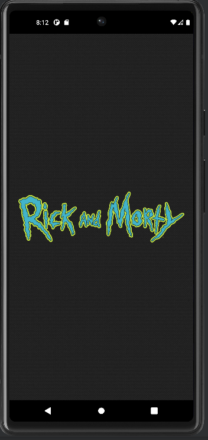

# Rick And Morty - Android

Мобильное приложение под Android. Привязанно к api: https://rickandmortyapi.com/. Отображает информацию о персонажах, локациях и эпизодов популярного мультсериала "Rick and Morty".

## Стек технологий
Основным языком выступает Kotlin, часть функционала реализована на Java.
Инъекция зависимостей - Dagger 2. Тестирование - JUnit4 + MockK

|Архитектурные подходы      |Асинхронное выполнение операций|   UI часть      |Работа с локальными и удаленными данными|
|----------------			|-------------------------------|-----------------|-------------------------------------------|
|MVVM  						|Coroutines                		|RecyclerView  	  |			Paging 3, SwipeRefreshLayout		                |
|Single Activity			|RxJava 2       				|Glide            |			Retrofit 2, Gson		        |
|Clean Architecture 		|								| 				  |  Roo, Flow / LiveData                        |

## Описание функциональной части

В приложении одна основная activity выступает контейнером для fragment-ов. При запуске приложения отображается splash screen на несколько секунд.

Далее открывается основной экран приложения (MainActivity) со страницей списка всех персонажей в сериале.
IMG

В нижнией части экрана распологается BottomNavigationView для перехода между фрагментами для отображения списков локаций, персонажей и эпизовод. Навигация реализована через интерфейс (OnNavigationListener), реализацию которого формирует основная activity. Каждый из фрагментов при инициализации в методе onAttach запрашивает данный интерфейс для последйюего управления навигацией.
