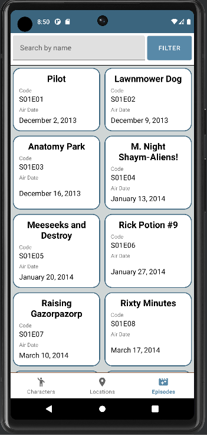
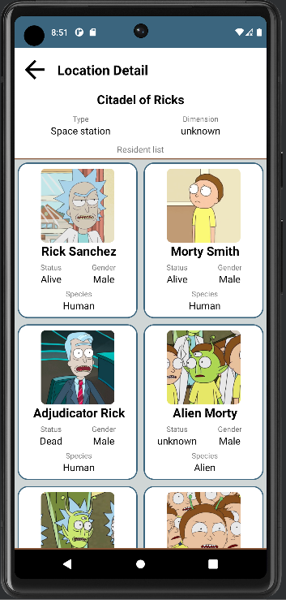

# Rick And Morty - Android

Мобильное приложение под Android. Привязанно к api: https://rickandmortyapi.com/. Отображает информацию о персонажах, локациях и эпизодов популярного мультсериала "Rick and Morty".

## Стек технологий
Основным языком выступает Kotlin, часть функционала реализована на Java.
Инъекция зависимостей - Dagger 2. Инъекция зависимостей реализована через интерфейсы и компоненты Тестирование - JUnit4 + MockK

|Архитектурные подходы      |Асинхронное выполнение операций|   UI часть      |Работа с локальными и удаленными данными|
|----------------			|-------------------------------|-----------------|-------------------------------------------|
|MVVM  						|Coroutines                		|RecyclerView  	  |			Paging 3, SwipeRefreshLayout		                |
|Single Activity			|RxJava 2       				|Glide            |			Retrofit 2, Gson		        |
|Clean Architecture 		|								| 				  |  Room, Flow / LiveData                        |

## Описание функциональной части

В приложении одна основная activity выступает контейнером для fragment-ов. При запуске приложения отображается splash screen на несколько секунд.

Далее открывается основной экран приложения (MainActivity) со фрагментом списка всех персонажей в сериале. В нижнией части экрана распологается BottomNavigationView для перехода между фрагментами для отображения списков локаций, персонажей и эпизовод. Навигация реализована через интерфейс (OnNavigationListener), реализацию которого формирует основная activity. Каждый из фрагментов при инициализации в методе onAttach запрашивает данный интерфейс для последйюего управления навигацией.

На всех экранах реализованы прогресс индекторы загрузки данных и уведомления пользователей об событиях в приложении, а также работу интернета с полным функционалом.

<a name="characterList"><h3>Фрагмент списка персонажей</h3></a>

 

На фрагменте представлен список задач в RecyclerView (PagingDataAdapter, DiffUtil, ViewHolder), текстовое поля для фильтрации имени и отдельная кнопка для запуска [фрагмента с фильтром](#filter). Данный фрагмент дополнительно используется на экранах с детальной информацией по локациям и эпизодам для отображения учавствующих там персонажей. При создании фрагмента необходимо указать, какой тип фрагмента требуется: только для отображения списка по id элементов или полный список с фильтрацией.

Данные для списка персонажей приходят по запросу с пагинацией: [документация по данному запросу](https://rickandmortyapi.com/documentation/#get-all-characters). С помощью RemoteMediator из Paging3 паралельно данные сохраняются в локальной базе данных для возможности работы без сети. Репозиторий постранично возвращает данные для отображения из локальной базы данных. Фрагмент поддерживает pull to refresh. 

По клику на элемент списка открывается фрагмент с [детальной информацией о персонаже](#characterDetail), при этом скрывается навигационная панель в приложении до того момента, пока пользователь не вернётся на один из главных экранов. 

<a name="characterDetail"><h3>Фрагмент детальной информации о персонаже</h3></a>
 

Фрагмент детальной информацией содержит в себе всё наиболее важную информацию о персонаже и включает в себя [фрагмент списка эпизодов](#characterList) для отображения эпизодов, где учавствовал данный персонаж. Данные приходят с запроса: [документация по данному запросу](https://rickandmortyapi.com/documentation/#get-a-single-character). Дополнительно с помощью remote mediator данные сохраняются в локальную базу данных для работы без сети. По клику на [место происхождения](#otherDetail) или [последнюю локацию](#otherDetail) реализован переход на фрагмент с детальной информацией о элементе. При инициализации фрагмента необходимо передать id элемента для отображения.

В левом верхнему углу находится кнопка для навигации назад. Фрагмент поддерживает pull to refresh.

<a name="episodeList"><h3>Фрагмент списка эпизодов </h3></a>

Данные приходят с запроса: [документация по запросу](https://rickandmortyapi.com/documentation/#get-all-episodes). Фрагмент ещё используется на странице с детольной информацией о персонаже, чтобы отображать список эпизодов, где персонаж участвовал.
Фрагмент реализует те же возможности, что и [фрагмент списка персонажей](#characterList). За исключением того, что при клике на элемент откроется фрагмент [детальной информации о эпизоде](#otherDetail).

<a name="characterList"><h3>Фрагмент списка локаций </h3></a>

 

Данные c пагинацией приходят с запроса: [документация по запросу](https://rickandmortyapi.com/documentation/#get-all-locations). Фрагмент реализует те же возможности, что и [фрагмент списка персонажей](#characterList). За исключением того, что фрагмент списка локаций не реализует локику использования без отображения элементов фильтрации, а также при клике на элемент откроется фрагмент [детальной информации о локации](#otherDetail).

<a name="otherDetail"><h3>Фрагмент детальной информации о локации / эпизоде </h3></a>

Данные о локации приходят с запроса: [документация по запросу](https://rickandmortyapi.com/documentation/#get-a-single-location). 
Данные о эпизоде приходят с запроса: [документация по запросу](https://rickandmortyapi.com/documentation/#get-a-single-episode). 

Фрагмент реализует те же возможности, что и [фрагмент детальной информации о персонаже](#characterDetail). За исключением того, что отображается список учавствующих персонажей, а па клику на элемент списка открывается фрагмент с детальной информацией о персанаже.

<a name="filter"><h3>Фрагмент фильтрации</h3></a>
Данный фрагмент является универсальным для списка персонажей, локаций и эпизодов. При инициалиации фрагмента необходимо указать, какой именнно тип требуется. В зависимости от указанного типа будут доступны необходимые элементы фильтрации, результат фильтрации возвращается через интерфейс, который реализует фрагмент запрашивающий фильтрацию. 

